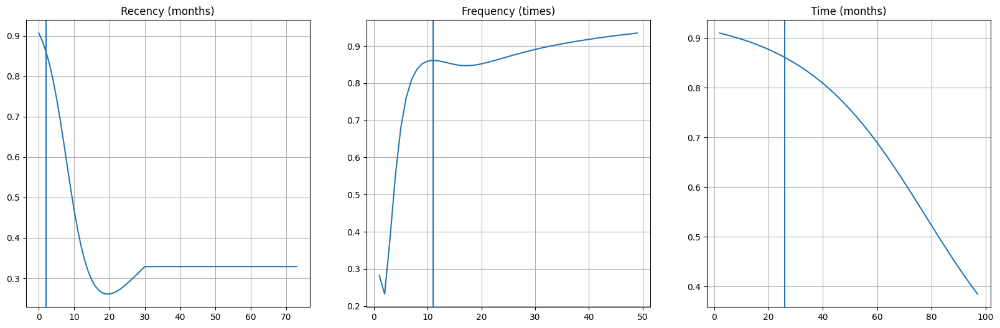
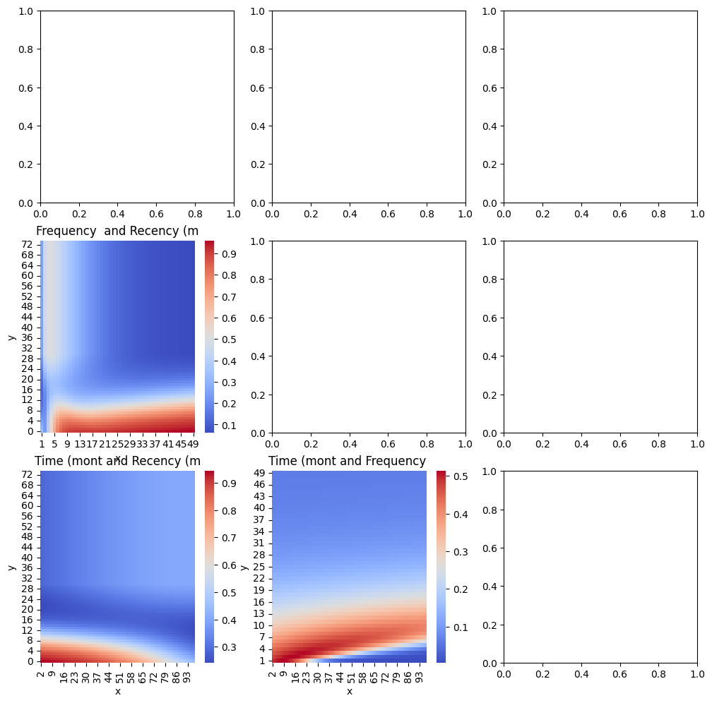

# 1. Import libraries


```python
import pandas as pd

import numpy as np
import torch as T
from torch.optim import Adam
from torch.utils.data import DataLoader, WeightedRandomSampler
from sklearn.metrics.pairwise import cosine_similarity
from sklearn.model_selection import train_test_split
from sklearn.preprocessing import FunctionTransformer, StandardScaler
from sklearn.pipeline import Pipeline
from sklearn.compose import ColumnTransformer
from copy import deepcopy
import matplotlib.pyplot as plt
import seaborn as sns

from pytorch_helper_functions import *
```

# 2. Import data


```python
link = "data/transfusion.data"
df = pd.read_csv(link)
# df = df.drop("Monetary (c.c. blood)", axis=1)
# df["Donation per month"] = df["Frequency (times)"] / df["Time (months)"]
# df["Months per donation"] = df["Time (months)"] / df["Frequency (times)"]
# df = df.drop("Time (months)", axis=1)
df.head()
```


<div>
<style scoped>
    .dataframe tbody tr th:only-of-type {
        vertical-align: middle;
    }

    .dataframe tbody tr th {
        vertical-align: top;
    }

    .dataframe thead th {
        text-align: right;
    }
</style>
<table border="1" class="dataframe">
  <thead>
    <tr style="text-align: right;">
      <th></th>
      <th>Recency (months)</th>
      <th>Frequency (times)</th>
      <th>Monetary (c.c. blood)</th>
      <th>Time (months)</th>
      <th>whether he/she donated blood in March 2007</th>
    </tr>
  </thead>
  <tbody>
    <tr>
      <th>0</th>
      <td>2</td>
      <td>50</td>
      <td>12500</td>
      <td>98</td>
      <td>1</td>
    </tr>
    <tr>
      <th>1</th>
      <td>0</td>
      <td>13</td>
      <td>3250</td>
      <td>28</td>
      <td>1</td>
    </tr>
    <tr>
      <th>2</th>
      <td>1</td>
      <td>16</td>
      <td>4000</td>
      <td>35</td>
      <td>1</td>
    </tr>
    <tr>
      <th>3</th>
      <td>2</td>
      <td>20</td>
      <td>5000</td>
      <td>45</td>
      <td>1</td>
    </tr>
    <tr>
      <th>4</th>
      <td>1</td>
      <td>24</td>
      <td>6000</td>
      <td>77</td>
      <td>0</td>
    </tr>
  </tbody>
</table>
</div>


```python
# separate exog and endog variables
y_var = "whether he/she donated blood in March 2007"
y = df[y_var]
X = df.drop(y_var, axis=1, inplace=False)
```

# 3. Preprocess data


```python
# X["Recency (months)"] = X["Recency (months)"].clip(upper=30)
# Train test split
X_train_df, X_test_df, y_train, y_test = train_test_split(X, y, random_state=42)

def divide_columns(X):
    # return (X[..., 1] / (X[..., 0] + 1)).reshape(-1, 1)
    output = (X.iloc[:, 1] / (X.iloc[:, 0] + 1))
    return pd.DataFrame(output)

select_columns = ColumnTransformer(transformers=[
    ("select", "passthrough", ["Frequency (times)"]),
    ("clip", FunctionTransformer(lambda x: x.clip(upper=30)), ["Recency (months)"]),
    ("divide", FunctionTransformer(
        divide_columns,
        # feature_names_out="one-to-one"
        ), ["Frequency (times)", "Time (months)"])
], remainder="drop")


preprocessing_pipe = Pipeline(
    [
        ("select_columns", select_columns),
        ("standard_scaler", StandardScaler())
    ]
)

```


```python
X_train_pipe_output = preprocessing_pipe.fit_transform(X_train_df)
X_test_pipe_output = preprocessing_pipe.transform(X_test_df)
X_train = T.tensor(X_train_pipe_output, dtype=T.float)
X_test = T.tensor(X_test_pipe_output, dtype=T.float)
y_train = T.tensor(y_train.to_numpy(), dtype=T.float).unsqueeze(-1)
y_test = T.tensor(y_test.to_numpy(), dtype=T.float).unsqueeze(-1)
```


```python
X_train_pipe_output
```


    array([[ 0.53522208, -0.06658136, -1.04725063],
           [-0.44176139, -0.06658136, -0.6114351 ],
           [-0.44176139,  1.55742477,  0.0766947 ],
           ...,
           [ 0.86088324,  0.88075555, -0.64966453],
           [ 0.20956092,  0.88075555,  1.25224977],
           [ 0.53522208, -0.74325057, -0.4967468 ]], shape=(561, 3))


# 4. Create model


```python
model = SimpleClassifier(X_train.shape[-1], 64)
```

# 5. Prepare iterator


```python
# Create train and test datasets
train_dt = CustomDataset(X_train, y_train)
test_dt = CustomDataset(X_test, y_test)

# Compute class counts
class_sample_counts = np.bincount(y_train.numpy().flatten().astype(int))
print(class_sample_counts)

# Compute class weights (inverse frequency)
weights = 1. / class_sample_counts

# Assign a weight to each sample
sample_weights = weights[y_train.numpy().flatten().astype(int)]

# Create sampler
sampler = WeightedRandomSampler(
    weights=sample_weights,
    num_samples=len(sample_weights),
    replacement=True
)

BATCH_SIZE = 32
train_dataloader = DataLoader(train_dt, batch_size=BATCH_SIZE, sampler=sampler)
# train_dataloader = DataLoader(train_dt, batch_size=BATCH_SIZE, shuffle=True)
test_dataloader = DataLoader(test_dt, batch_size=1024)
```

    [431 130]
    

# 6. Create functions for training and parameters


```python
optimizer = Adam(model.parameters(), lr=0.0002, weight_decay=0.0001)
loss_fn = nn.BCEWithLogitsLoss()
early_stopper = EarlyStopping(patience=20)

epochs = 10000

smoothing = True

train_losses = []
show_step = 10
```

# 7. Training


```python
for epoch in range(epochs):
    for batch_x, batch_y in train_dataloader:
        batch_y_smoothed = smooth_labels(batch_y, smoothing=0.1)
        logits = model(batch_x)
        loss = loss_fn(logits, batch_y_smoothed if smoothing else batch_y)
        
        optimizer.zero_grad()
        loss.backward()
        nn.utils.clip_grad_norm_(model.parameters(), max_norm=1.)
        optimizer.step()
        train_losses.append(loss.item())
        
    if epoch % show_step == 0:
        # for batch_x, batch_y in test_dataloader:
        logits = model(X_test).detach()
        loss = loss_fn(logits, y_test)
            
            
        print(
            f"Epoch: {epoch}, train_loss {np.mean(train_losses):.4f}, test_loss {loss.item():.4f}"
            )
        evaluate_model(y_test[:, 0], y_pred=T.sigmoid(logits[:, 0]))
        train_losses = []
        train_accuracy = []
        early_stopper(loss.item(), deepcopy(model.state_dict()))

        if early_stopper.early_stop:
            print("Early stopping triggered.")
            model.load_state_dict(early_stopper.state_dict)
            print(f"Best model loaded with loss {early_stopper.best_score:.4f}")
            break
```

    Epoch: 0, train_loss 0.6697, test_loss 0.6713
    Accuracy: 0.6150
    F1 Score: 0.5200
    AUC 0.7502
    Epoch: 10, train_loss 0.6301, test_loss 0.6039
    Accuracy: 0.6364
    F1 Score: 0.5211
    AUC 0.7613
    New best score 0.603891
    Epoch: 20, train_loss 0.6106, test_loss 0.5852
    Accuracy: 0.6524
    F1 Score: 0.5324
    AUC 0.7598
    New best score 0.585207
    Epoch: 30, train_loss 0.6123, test_loss 0.5954
    Accuracy: 0.6631
    F1 Score: 0.5401
    AUC 0.7571
    Epoch: 40, train_loss 0.6093, test_loss 0.5875
    Accuracy: 0.7112
    F1 Score: 0.5645
    AUC 0.7571
    Epoch: 50, train_loss 0.6000, test_loss 0.5923
    Accuracy: 0.6631
    F1 Score: 0.5401
    AUC 0.7591
    Epoch: 60, train_loss 0.5998, test_loss 0.6085
    Accuracy: 0.6631
    F1 Score: 0.5401
    AUC 0.7606
    Epoch: 70, train_loss 0.5953, test_loss 0.5846
    Accuracy: 0.7112
    F1 Score: 0.5645
    AUC 0.7631
    New best score 0.584563
    Epoch: 80, train_loss 0.5907, test_loss 0.5776
    Accuracy: 0.7273
    F1 Score: 0.5785
    AUC 0.7624
    New best score 0.577642
    Epoch: 90, train_loss 0.5978, test_loss 0.5938
    Accuracy: 0.7166
    F1 Score: 0.5691
    AUC 0.7634
    Epoch: 100, train_loss 0.5951, test_loss 0.5844
    Accuracy: 0.7326
    F1 Score: 0.5833
    AUC 0.7637
    Epoch: 110, train_loss 0.5940, test_loss 0.5756
    Accuracy: 0.7326
    F1 Score: 0.5833
    AUC 0.7609
    New best score 0.575640
    Epoch: 120, train_loss 0.5986, test_loss 0.5782
    Accuracy: 0.7326
    F1 Score: 0.5833
    AUC 0.7594
    Epoch: 130, train_loss 0.5972, test_loss 0.5932
    Accuracy: 0.7273
    F1 Score: 0.5785
    AUC 0.7610
    Epoch: 140, train_loss 0.5924, test_loss 0.5940
    Accuracy: 0.7219
    F1 Score: 0.5738
    AUC 0.7610
    Epoch: 150, train_loss 0.5893, test_loss 0.5876
    Accuracy: 0.7380
    F1 Score: 0.5882
    AUC 0.7603
    Epoch: 160, train_loss 0.5870, test_loss 0.5818
    Accuracy: 0.7219
    F1 Score: 0.5738
    AUC 0.7607
    Epoch: 170, train_loss 0.5936, test_loss 0.5821
    Accuracy: 0.7273
    F1 Score: 0.5714
    AUC 0.7583
    Epoch: 180, train_loss 0.5874, test_loss 0.5759
    Accuracy: 0.7326
    F1 Score: 0.5833
    AUC 0.7630
    Epoch: 190, train_loss 0.5870, test_loss 0.5872
    Accuracy: 0.7166
    F1 Score: 0.5691
    AUC 0.7615
    Epoch: 200, train_loss 0.5939, test_loss 0.5834
    Accuracy: 0.7219
    F1 Score: 0.5439
    AUC 0.7609
    Epoch: 210, train_loss 0.5867, test_loss 0.5817
    Accuracy: 0.7166
    F1 Score: 0.5691
    AUC 0.7618
    Epoch: 220, train_loss 0.5911, test_loss 0.5772
    Accuracy: 0.7059
    F1 Score: 0.5045
    AUC 0.7573
    Epoch: 230, train_loss 0.5900, test_loss 0.5783
    Accuracy: 0.7166
    F1 Score: 0.5310
    AUC 0.7595
    Epoch: 240, train_loss 0.5875, test_loss 0.5746
    Accuracy: 0.7326
    F1 Score: 0.5455
    AUC 0.7598
    New best score 0.574635
    Epoch: 250, train_loss 0.5923, test_loss 0.5703
    Accuracy: 0.7166
    F1 Score: 0.5047
    AUC 0.7568
    New best score 0.570278
    Epoch: 260, train_loss 0.5872, test_loss 0.5894
    Accuracy: 0.7166
    F1 Score: 0.5620
    AUC 0.7592
    Epoch: 270, train_loss 0.5815, test_loss 0.5698
    Accuracy: 0.7166
    F1 Score: 0.5138
    AUC 0.7585
    New best score 0.569808
    Epoch: 280, train_loss 0.5902, test_loss 0.5862
    Accuracy: 0.7166
    F1 Score: 0.5620
    AUC 0.7616
    Epoch: 290, train_loss 0.5849, test_loss 0.5658
    Accuracy: 0.7273
    F1 Score: 0.5234
    AUC 0.7600
    New best score 0.565780
    Epoch: 300, train_loss 0.5910, test_loss 0.5825
    Accuracy: 0.7273
    F1 Score: 0.5714
    AUC 0.7586
    Epoch: 310, train_loss 0.5816, test_loss 0.5859
    Accuracy: 0.7112
    F1 Score: 0.5263
    AUC 0.7573
    Epoch: 320, train_loss 0.5848, test_loss 0.5865
    Accuracy: 0.7166
    F1 Score: 0.5620
    AUC 0.7615
    Epoch: 330, train_loss 0.5898, test_loss 0.5650
    Accuracy: 0.7273
    F1 Score: 0.5234
    AUC 0.7550
    New best score 0.564959
    Epoch: 340, train_loss 0.5857, test_loss 0.5737
    Accuracy: 0.7326
    F1 Score: 0.5455
    AUC 0.7589
    Epoch: 350, train_loss 0.5786, test_loss 0.6030
    Accuracy: 0.6738
    F1 Score: 0.5414
    AUC 0.7514
    Epoch: 360, train_loss 0.5875, test_loss 0.5768
    Accuracy: 0.7219
    F1 Score: 0.5185
    AUC 0.7573
    Epoch: 370, train_loss 0.5818, test_loss 0.5584
    Accuracy: 0.7273
    F1 Score: 0.5143
    AUC 0.7583
    New best score 0.558432
    Epoch: 380, train_loss 0.5883, test_loss 0.5746
    Accuracy: 0.7273
    F1 Score: 0.5234
    AUC 0.7508
    Epoch: 390, train_loss 0.5780, test_loss 0.5789
    Accuracy: 0.7326
    F1 Score: 0.5455
    AUC 0.7625
    Epoch: 400, train_loss 0.5775, test_loss 0.5675
    Accuracy: 0.7219
    F1 Score: 0.5185
    AUC 0.7646
    Epoch: 410, train_loss 0.5790, test_loss 0.5657
    Accuracy: 0.7273
    F1 Score: 0.5234
    AUC 0.7508
    Epoch: 420, train_loss 0.5840, test_loss 0.5788
    Accuracy: 0.7326
    F1 Score: 0.5455
    AUC 0.7588
    Epoch: 430, train_loss 0.5822, test_loss 0.5753
    Accuracy: 0.7219
    F1 Score: 0.5185
    AUC 0.7558
    Epoch: 440, train_loss 0.5919, test_loss 0.5859
    Accuracy: 0.7273
    F1 Score: 0.5405
    AUC 0.7553
    Epoch: 450, train_loss 0.5708, test_loss 0.5747
    Accuracy: 0.7326
    F1 Score: 0.5455
    AUC 0.7567
    Epoch: 460, train_loss 0.5792, test_loss 0.5764
    Accuracy: 0.7219
    F1 Score: 0.5185
    AUC 0.7541
    Epoch: 470, train_loss 0.5885, test_loss 0.5800
    Accuracy: 0.7273
    F1 Score: 0.5405
    AUC 0.7561
    Epoch: 480, train_loss 0.5809, test_loss 0.5692
    Accuracy: 0.7273
    F1 Score: 0.5234
    AUC 0.7535
    Epoch: 490, train_loss 0.5843, test_loss 0.5885
    Accuracy: 0.7273
    F1 Score: 0.5405
    AUC 0.7532
    Epoch: 500, train_loss 0.5878, test_loss 0.5972
    Accuracy: 0.7273
    F1 Score: 0.5405
    AUC 0.7567
    Epoch: 510, train_loss 0.5772, test_loss 0.5774
    Accuracy: 0.7273
    F1 Score: 0.5234
    AUC 0.7505
    Epoch: 520, train_loss 0.5758, test_loss 0.5827
    Accuracy: 0.7273
    F1 Score: 0.5234
    AUC 0.7495
    Epoch: 530, train_loss 0.5833, test_loss 0.5753
    Accuracy: 0.7273
    F1 Score: 0.5234
    AUC 0.7511
    Epoch: 540, train_loss 0.5926, test_loss 0.5843
    Accuracy: 0.7326
    F1 Score: 0.5455
    AUC 0.7535
    Epoch: 550, train_loss 0.5773, test_loss 0.5764
    Accuracy: 0.7273
    F1 Score: 0.5234
    AUC 0.7519
    Epoch: 560, train_loss 0.5740, test_loss 0.5640
    Accuracy: 0.7326
    F1 Score: 0.5283
    AUC 0.7496
    Epoch: 570, train_loss 0.5768, test_loss 0.5839
    Accuracy: 0.7166
    F1 Score: 0.5138
    AUC 0.7538
    Early stopping triggered.
    Best model loaded with loss 0.5584
    

# 8. Error analysis


```python
X_val = X_test_df.copy()
X_val['y_pred'] = T.sigmoid(logits[:, 0])
X_val['y_true'] = y_test
X_val.head()
```


<div>
<style scoped>
    .dataframe tbody tr th:only-of-type {
        vertical-align: middle;
    }

    .dataframe tbody tr th {
        vertical-align: top;
    }

    .dataframe thead th {
        text-align: right;
    }
</style>
<table border="1" class="dataframe">
  <thead>
    <tr style="text-align: right;">
      <th></th>
      <th>Recency (months)</th>
      <th>Frequency (times)</th>
      <th>Monetary (c.c. blood)</th>
      <th>Time (months)</th>
      <th>y_pred</th>
      <th>y_true</th>
    </tr>
  </thead>
  <tbody>
    <tr>
      <th>580</th>
      <td>2</td>
      <td>1</td>
      <td>250</td>
      <td>2</td>
      <td>0.449943</td>
      <td>0.0</td>
    </tr>
    <tr>
      <th>356</th>
      <td>16</td>
      <td>6</td>
      <td>1500</td>
      <td>40</td>
      <td>0.329274</td>
      <td>0.0</td>
    </tr>
    <tr>
      <th>133</th>
      <td>4</td>
      <td>6</td>
      <td>1500</td>
      <td>35</td>
      <td>0.701317</td>
      <td>0.0</td>
    </tr>
    <tr>
      <th>250</th>
      <td>11</td>
      <td>2</td>
      <td>500</td>
      <td>11</td>
      <td>0.474105</td>
      <td>0.0</td>
    </tr>
    <tr>
      <th>299</th>
      <td>14</td>
      <td>2</td>
      <td>500</td>
      <td>14</td>
      <td>0.356788</td>
      <td>0.0</td>
    </tr>
  </tbody>
</table>
</div>


```python
X_val.iloc[np.argsort(cosine_similarity(X_test)[X_val.index.get_loc(511)])[-20:][::-1]]
```


<div>
<style scoped>
    .dataframe tbody tr th:only-of-type {
        vertical-align: middle;
    }

    .dataframe tbody tr th {
        vertical-align: top;
    }

    .dataframe thead th {
        text-align: right;
    }
</style>
<table border="1" class="dataframe">
  <thead>
    <tr style="text-align: right;">
      <th></th>
      <th>Recency (months)</th>
      <th>Frequency (times)</th>
      <th>Monetary (c.c. blood)</th>
      <th>Time (months)</th>
      <th>y_pred</th>
      <th>y_true</th>
    </tr>
  </thead>
  <tbody>
    <tr>
      <th>511</th>
      <td>2</td>
      <td>11</td>
      <td>2750</td>
      <td>26</td>
      <td>0.879173</td>
      <td>0.0</td>
    </tr>
    <tr>
      <th>31</th>
      <td>4</td>
      <td>10</td>
      <td>2500</td>
      <td>28</td>
      <td>0.808720</td>
      <td>1.0</td>
    </tr>
    <tr>
      <th>97</th>
      <td>4</td>
      <td>9</td>
      <td>2250</td>
      <td>38</td>
      <td>0.770479</td>
      <td>1.0</td>
    </tr>
    <tr>
      <th>7</th>
      <td>1</td>
      <td>12</td>
      <td>3000</td>
      <td>35</td>
      <td>0.882286</td>
      <td>0.0</td>
    </tr>
    <tr>
      <th>33</th>
      <td>4</td>
      <td>9</td>
      <td>2250</td>
      <td>26</td>
      <td>0.819747</td>
      <td>1.0</td>
    </tr>
    <tr>
      <th>56</th>
      <td>4</td>
      <td>8</td>
      <td>2000</td>
      <td>26</td>
      <td>0.819349</td>
      <td>1.0</td>
    </tr>
    <tr>
      <th>2</th>
      <td>1</td>
      <td>16</td>
      <td>4000</td>
      <td>35</td>
      <td>0.888352</td>
      <td>1.0</td>
    </tr>
    <tr>
      <th>30</th>
      <td>1</td>
      <td>14</td>
      <td>3500</td>
      <td>58</td>
      <td>0.808586</td>
      <td>0.0</td>
    </tr>
    <tr>
      <th>541</th>
      <td>2</td>
      <td>10</td>
      <td>2500</td>
      <td>52</td>
      <td>0.759256</td>
      <td>0.0</td>
    </tr>
    <tr>
      <th>39</th>
      <td>4</td>
      <td>7</td>
      <td>1750</td>
      <td>22</td>
      <td>0.825442</td>
      <td>1.0</td>
    </tr>
    <tr>
      <th>527</th>
      <td>2</td>
      <td>15</td>
      <td>3750</td>
      <td>64</td>
      <td>0.754453</td>
      <td>0.0</td>
    </tr>
    <tr>
      <th>6</th>
      <td>2</td>
      <td>7</td>
      <td>1750</td>
      <td>14</td>
      <td>0.886571</td>
      <td>1.0</td>
    </tr>
    <tr>
      <th>60</th>
      <td>2</td>
      <td>7</td>
      <td>1750</td>
      <td>29</td>
      <td>0.828987</td>
      <td>0.0</td>
    </tr>
    <tr>
      <th>69</th>
      <td>1</td>
      <td>9</td>
      <td>2250</td>
      <td>51</td>
      <td>0.757529</td>
      <td>0.0</td>
    </tr>
    <tr>
      <th>101</th>
      <td>2</td>
      <td>13</td>
      <td>3250</td>
      <td>76</td>
      <td>0.647353</td>
      <td>1.0</td>
    </tr>
    <tr>
      <th>65</th>
      <td>3</td>
      <td>16</td>
      <td>4000</td>
      <td>74</td>
      <td>0.679406</td>
      <td>0.0</td>
    </tr>
    <tr>
      <th>23</th>
      <td>2</td>
      <td>6</td>
      <td>1500</td>
      <td>16</td>
      <td>0.857632</td>
      <td>1.0</td>
    </tr>
    <tr>
      <th>557</th>
      <td>4</td>
      <td>6</td>
      <td>1500</td>
      <td>30</td>
      <td>0.750019</td>
      <td>0.0</td>
    </tr>
    <tr>
      <th>109</th>
      <td>2</td>
      <td>10</td>
      <td>2500</td>
      <td>64</td>
      <td>0.655295</td>
      <td>0.0</td>
    </tr>
    <tr>
      <th>72</th>
      <td>4</td>
      <td>17</td>
      <td>4250</td>
      <td>71</td>
      <td>0.663406</td>
      <td>1.0</td>
    </tr>
  </tbody>
</table>
</div>


```python
X_val.sort_values(["y_pred"], axis=0, ascending=False).head(10)
```


<div>
<style scoped>
    .dataframe tbody tr th:only-of-type {
        vertical-align: middle;
    }

    .dataframe tbody tr th {
        vertical-align: top;
    }

    .dataframe thead th {
        text-align: right;
    }
</style>
<table border="1" class="dataframe">
  <thead>
    <tr style="text-align: right;">
      <th></th>
      <th>Recency (months)</th>
      <th>Frequency (times)</th>
      <th>Monetary (c.c. blood)</th>
      <th>Time (months)</th>
      <th>y_pred</th>
      <th>y_true</th>
    </tr>
  </thead>
  <tbody>
    <tr>
      <th>2</th>
      <td>1</td>
      <td>16</td>
      <td>4000</td>
      <td>35</td>
      <td>0.888352</td>
      <td>1.0</td>
    </tr>
    <tr>
      <th>6</th>
      <td>2</td>
      <td>7</td>
      <td>1750</td>
      <td>14</td>
      <td>0.886571</td>
      <td>1.0</td>
    </tr>
    <tr>
      <th>7</th>
      <td>1</td>
      <td>12</td>
      <td>3000</td>
      <td>35</td>
      <td>0.882286</td>
      <td>0.0</td>
    </tr>
    <tr>
      <th>511</th>
      <td>2</td>
      <td>11</td>
      <td>2750</td>
      <td>26</td>
      <td>0.879173</td>
      <td>0.0</td>
    </tr>
    <tr>
      <th>23</th>
      <td>2</td>
      <td>6</td>
      <td>1500</td>
      <td>16</td>
      <td>0.857632</td>
      <td>1.0</td>
    </tr>
    <tr>
      <th>60</th>
      <td>2</td>
      <td>7</td>
      <td>1750</td>
      <td>29</td>
      <td>0.828987</td>
      <td>0.0</td>
    </tr>
    <tr>
      <th>39</th>
      <td>4</td>
      <td>7</td>
      <td>1750</td>
      <td>22</td>
      <td>0.825442</td>
      <td>1.0</td>
    </tr>
    <tr>
      <th>33</th>
      <td>4</td>
      <td>9</td>
      <td>2250</td>
      <td>26</td>
      <td>0.819747</td>
      <td>1.0</td>
    </tr>
    <tr>
      <th>56</th>
      <td>4</td>
      <td>8</td>
      <td>2000</td>
      <td>26</td>
      <td>0.819349</td>
      <td>1.0</td>
    </tr>
    <tr>
      <th>28</th>
      <td>4</td>
      <td>5</td>
      <td>1250</td>
      <td>11</td>
      <td>0.816573</td>
      <td>1.0</td>
    </tr>
  </tbody>
</table>
</div>


```python
y_pred = T.sigmoid(model(X_test)).detach()
# Final metrics
evaluate_model(y_test[:, 0], y_pred=y_pred[:, 0])
```

    Accuracy: 0.7273
    F1 Score: 0.5143
    AUC 0.7583
    

# 9. Point Explainer


```python
idx = 511
base_df = X_test_df.loc[[idx]]
list_ = []

valid_columns = ['Recency (months)',
 'Frequency (times)',
 'Time (months)']

fig, ax = plt.subplots(1, len(valid_columns), figsize=(20,6))

for n, col in enumerate(valid_columns):
    temp_list = []
    max_value = X_train_df[col].max()
    min_value = X_train_df[col].min()
    temp_df = base_df.copy()
    if X_train_df[col].dtype == "int":
        iterator = range(min_value, max_value)
        
    for i in iterator:
        temp_df[col] = i
        with T.no_grad():
            tens = preprocessing_pipe.transform(temp_df)
            tens = T.tensor(tens, dtype=T.float)
            y_pred = T.sigmoid(model(tens))
        temp_list.append((i, y_pred.mean()))
        
    x, y = zip(*temp_list)
    ax[n].plot(x, y)  # or use plt.scatter(x, y)
    # ax[n].xlabel("X axis")
    # ax[n].ylabel("Y axis")
    ax[n].axvline(x=base_df[col].to_numpy()[0])
    ax[n].set_title(col)
    ax[n].grid(True)
    list_.append(temp_list)
    
plt.show()
plt.close()
```


    

    


Cross impacts


```python
idx = 511
base_df = X_test_df.loc[[idx]]
list_ = []

fig, ax = plt.subplots(len(valid_columns), len(valid_columns), figsize=(12,12))

for n1, col1 in enumerate(valid_columns):
    
    temp_df = base_df.copy()
    max_value = X_train_df[col1].max()
    min_value = X_train_df[col1].min()
    if X_train_df[col1].dtype == "int":
        iterator1 = range(min_value, max_value)
    
    for n2, col2 in enumerate(valid_columns):
        # so it weren't any duplicates
        if n1 > n2:
            temp_list = []
            max_value = X_train_df[col2].max()
            min_value = X_train_df[col2].min()
            
            if X_train_df[col2].dtype == "int":
                iterator2 = range(min_value, max_value)
            
            for i1 in iterator1:
                for i2 in iterator2:
                    temp_df[col1] = i1
                    temp_df[col2] = i2
                    with T.no_grad():
                        tens = preprocessing_pipe.transform(temp_df)
                        tens = T.tensor(tens, dtype=T.float)
                        y_pred = T.sigmoid(model(tens))
                    temp_list.append((i1, i2, y_pred.mean().item()))
                
        else:
            temp_list = None
    
    
        if temp_list:
            df = pd.DataFrame(temp_list, columns=["x", "y", "value"])
            heatmap_data = df.pivot(index='y', columns='x', values='value')  # flip x/y for display
            sns.heatmap(heatmap_data, ax=ax[n1, n2], cmap="coolwarm", annot=False)
            ax[n1, n2].invert_yaxis()
            ax[n1, n2].set_title(f"{col1[:10]} and {col2[:10]}")
            list_.append((col1, col2, temp_list))
        
    
plt.show()
plt.close()
```


    

    


```python

```
